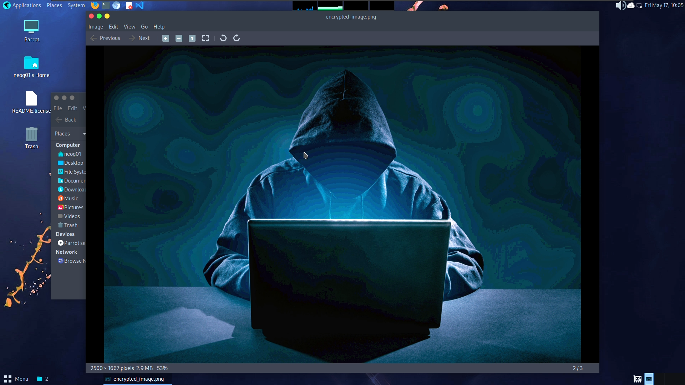

# Pixel manipulation for Image Encryption 
> Prodigy InfoTech Internship (Task_02)

* Create a python program that can manipulate each pixel of the image by performing a XOR operation with integer value given by the user.

```

  "Author": "Shourya Gupta",
  "Language": "Python",

```
***
## Task list
- [x] Open a window input dialog box in order to select the image location.
- [ ] Take the user input image.
- [ ] Ask the user to input the required integer manipulation key.
- [ ] Perform the XOR mathematical operation using the given key on each pixel.
- [ ] Decrypt the encrypted image using the same key.
- [ ] Save both the encrypted and decrypted image in the same directory of the program file.

## Dependencies

```
pip install tkinter PIL
```
---
## Output Snapshot
<p align="center"></p>
